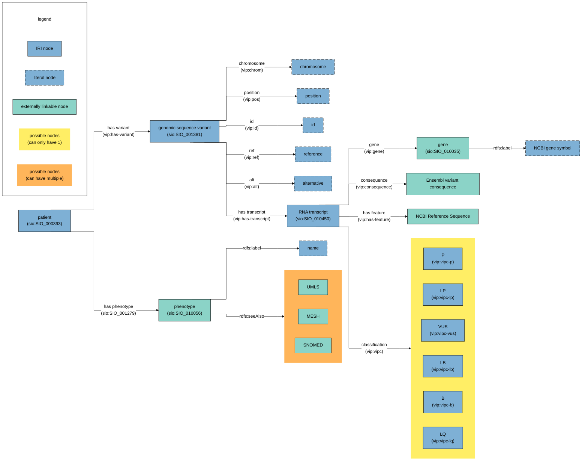

# vip2rdf

Converting (a part of) VIP vcf files into RDF Turtle files.

## Requirements

* Java 17+
* [Ensembl glossary (.owl)](https://raw.githubusercontent.com/Ensembl/ensembl-glossary/93c46f58299411f3b7d76c040b9cb73e907084a2/ensembl-glossary.owl) * - [license](https://www.ensembl.org/info/about/legal/disclaimer.html)
* [Human Phenotype Ontology (.owl)](https://github.com/obophenotype/human-phenotype-ontology/releases/latest/download/hp.owl) - [license](https://hpo.jax.org/app/license)

\* = Currently outdated, see F.A.Q. in case of errors.

## Regarding the RDF files

An uuid was created for defining terms within the generated files: `urn:uuid:E4CBEA11-46B8-4B68-A202-B9FC8E5BE255#`

## RDF design



Note: every unique subject has an `rdfs:label "<label>"`. The diagram only explicitly mentions the cases where the `rdfs:label` contains information that is not very similar to the IRI itself (f.e. a gene ID IRI but the symbol as label).

### Namespace usage 

| Prefix   | Namespace                                        | Usage                                                                                                                         |
|----------|--------------------------------------------------|-------------------------------------------------------------------------------------------------------------------------------|
| rdf      | http://www.w3.org/1999/02/22-rdf-syntax-ns#      | Generic rdf namespace                                                                                                         |
| rdfs     | http://www.w3.org/2000/01/rdf-schema#            | Generic rdfs namespace                                                                                                        |
| dcterms  | http://purl.org/dc/terms/                        | Description predicate for longer name than rdfs:label where needed                                                            |
| obo      | http://purl.obolibrary.org/obo/                  | Sequence ontology (`SO_<number>`) \& HPO (`HP_<number>`) IRIs                                                                  |
| sio      | http://semanticscience.org/resource/             | All kinds of IRIs to describe data (predicates \& rdf:type objects)                                                           |
| ncbigene | http://identifiers.org/ncbigene/                 | NCBI Gene ID IRIs                                                                                                             |
| refseq   | http://identifiers.org/refseq/                   | NCBI Reference Sequences IRIs                                                                                                 |
| ensembl  | http://ensembl.org/glossary/                     | Using the Ensembl glossary, String-formatted VEP data in the VIP output is converted to their corresponding semantic web IRIs |
| vip      | `urn:uuid:E4CBEA11-46B8-4B68-A202-B9FC8E5BE255#` | General IRIs specific for this project                                                                                        |
|          | `urn:uuid:[output file specific UUID]#`          | Patients/variants/transcripts specific for a single generated turtle output file                                              |


## F.A.Q.

__Problem:__

The application gives the following error: `ensembl-glossary missing data for consequence: <value>`

__Solution:__

As of writing, the Ensembl glossary is outdated.
Until https://github.com/Ensembl/ensembl-glossary/pull/10 is merged, one can add the following to the `ensembl-glossary.owl` as a workaround:

```xml
    <owl:Class rdf:about="urn:uuid:22a5da96-5fa4-11ee-819c-bf50a878822f#1">
        <rdfs:label rdf:datatype="http://www.w3.org/2001/XMLSchema#string">Splice donor 5th base variant</rdfs:label>
    </owl:Class>
    <owl:Class rdf:about="urn:uuid:22a5da96-5fa4-11ee-819c-bf50a878822f#2">
        <rdfs:label rdf:datatype="http://www.w3.org/2001/XMLSchema#string">Splice donor region variant</rdfs:label>
    </owl:Class>
    <owl:Class rdf:about="urn:uuid:22a5da96-5fa4-11ee-819c-bf50a878822f#3">
        <rdfs:label rdf:datatype="http://www.w3.org/2001/XMLSchema#string">Splice polypyrimidine tract variant</rdfs:label>
    </owl:Class>
    <owl:Class rdf:about="urn:uuid:22a5da96-5fa4-11ee-819c-bf50a878822f#4">
        <rdfs:label rdf:datatype="http://www.w3.org/2001/XMLSchema#string">Start retained variant</rdfs:label>
    </owl:Class>
    <owl:Class rdf:about="urn:uuid:22a5da96-5fa4-11ee-819c-bf50a878822f#5">
        <rdfs:label rdf:datatype="http://www.w3.org/2001/XMLSchema#string">Coding transcript variant</rdfs:label>
    </owl:Class>
```

## Development

### Installation

Generate a personal access token in GitHub with at least the scope "read:packages".

Then add a settings.xml to your Maven .m2 folder, or edit it if you already have one. It should
contain the following:

```
<?xml version="1.0"?>

<settings xsi:schemaLocation="http://maven.apache.org/SETTINGS/1.0.0 http://maven.apache.org/xsd/settings-1.0.0.xsd" xmlns:xsi="http://www.w3.org/2001/XMLSchema-instance" xmlns="http://maven.apache.org/SETTINGS/1.0.0">
  <activeProfiles>
    <activeProfile>github</activeProfile>
  </activeProfiles>
  <profiles>
    <profile>
      <id>github</id>
      <repositories>
        <repository>
          <id>central</id>
          <url>https://repo1.maven.org/maven2</url>
          </repository>
          <repository>
            <id>github</id>
            <url>https://maven.pkg.github.com/molgenis/vip-utils</url>
            <snapshots>
              <enabled>true</enabled>
            </snapshots>
        </repository>
      </repositories>
    </profile>
  </profiles>

  <servers>
    <server>
      <id>github</id>
      <username>[YOUR VIP USERNAME]</username>
      <password>[YOUR PERSONAL ACCESS TOKEN]</password>
    </server>
   </servers>
</settings>
```

### Testing data

See [this README](./src/test/resources/README.md) for information about the test files used for integration testing.