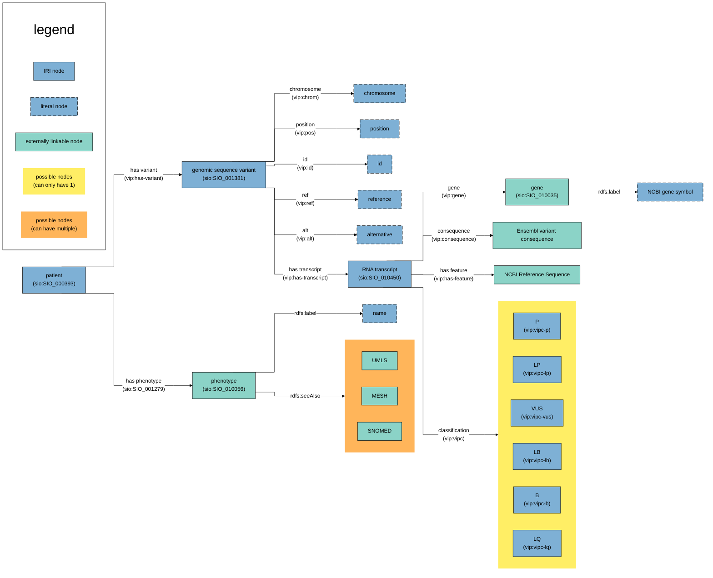

# vip2rdf

A concept version of converting (a part of) VIP vcf files into RDF Turtle files.

## Regarding the RDF files

An uuid was created for defining terms within the generated files: `urn:uuid:E4CBEA11-46B8-4B68-A202-B9FC8E5BE255#`

## Basic ttl file without enrichers

Note: every unique subject has an `rdfs:label "<label>"`. The diagram only explicitly mentions the cases where the `rdfs:label` contains information that is not very similar to the IRI itself (f.e. a gene ID IRI but the symbol as label).